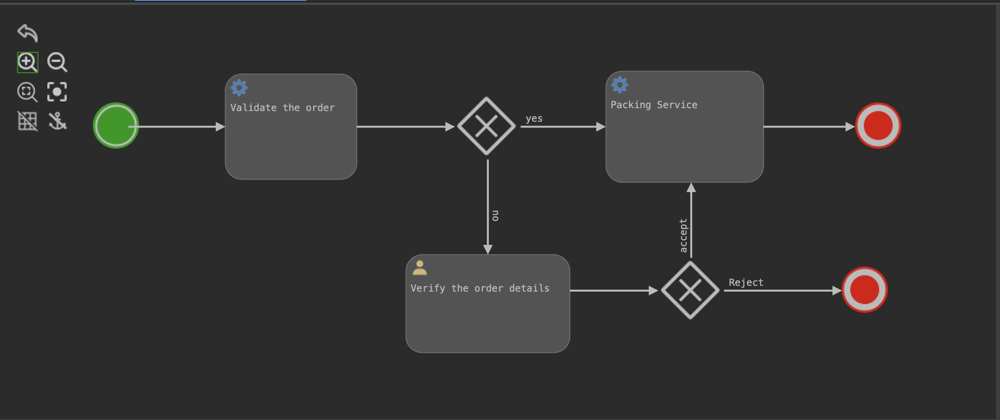

# spring-boot-with-activiti
Activiti is an Apache-licensed BPM engine, which we can use to define the process, a process can consist of a set of human tasks and service tasks.

Some features are:
* BPMN Support 
* Sub-processing
* Rest engine
* Retry feature for the service tasks 
* Auditing 

This repo is to explore some features of Activiti, 

You can find an example BPMN process definition under `/resources/processes/order-process.bpmn20.xml`, the process will get loaded into the system as part of the application startup, 
As this app is using in-memory DB(H2) it doesn't persist runtime and completed process details in disk.

You can access the [H2 database console](http://localhost:9090/activiti/h2-console) by using the database url from logs.

## Start
You can start the app using mvn command `mvn spring-boot:run`

## Start the Order Process Flow using the rest-api




### 1. Complete the initiated process only with service-tasks

*Start the order process flow with item quantity less than 5, the process should complete fully.*
```shell
curl --location 'http://localhost:9090/activiti/start' --header 'Content-Type: application/json' \
--data '{
	"processDefinitionKey":"orderProcess",
    "order":{
        "id":"OR89002",
        "status":"initiated",
        "orderItems":[
            {
                "id":89001,
                "name":"Chocolate Box",
                "quantity": 5,
                "price": 100
            }
        ]
    },
    "businessKey":"businessKey001"
}'
```

### 2. Complete the initiated process with a service-tasks and user-task.

*Start the order process flow with item quantity greater than 5, the process should wait at user-task.*
```shell
curl --location 'http://localhost:9090/activiti/start' --header 'Content-Type: application/json' \
--data '{
	"processDefinitionKey":"orderProcess",
    "order":{
        "id":"OR89002",
        "status":"initiated",
        "orderItems":[
            {
                "id":89001,
                "name":"Chocolate Box",
                "quantity": 100,
                "price": 100
            }
        ]
    },
    "businessKey":"businessKey001"
}'
```

*Get active userTasks list*
```curl
curl --location --request GET 'http://localhost:9090/activiti/tasks
```

*Complete the userTask*
```curl
curl --location --request PUT 'http://localhost:9090/activiti/tasks/c66e9ea0-c6c1-11ee-a049-02b5cad86a21'
```